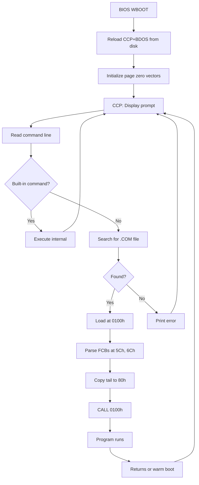

# CCP - Console Command Processor

## Overview

The CCP is the command-line interface. It displays the prompt, parses commands, and either executes built-in commands or loads .COM files from disk.

## Boot Sequence



## Built-in Commands

| Command | Description |
|---------|-------------|
| `dir [filespec]` | List directory |
| `era filespec` | Erase files (wildcards allowed) |
| `ren new=old` | Rename file |
| `save n file` | Save n pages from TPA to file |
| `type file` | Display text file |
| `user n` | Switch user area (0-15) |
| `d:` | Change current drive |

## Command Line Parsing

1. Convert to uppercase
2. Extract drive prefix if present (e.g., `B:`)
3. Parse first filename into FCB at 005Ch
4. Parse second filename into FCB at 006Ch
5. Store remainder (command tail) at 0080h with length byte

## Prompt Format

```
A>_
```

Where A is current drive letter (A-P) and > is the prompt character.

## Transient Command Loading

1. Add `.COM` extension to FCB (DFCB+9 = "COM")
2. Call BDOS Open (FUNC15) to find file
3. Load file at 0100h in 128-byte records (FUNC20)
4. Check for overflow into CCP address space
5. Initialize: DMA=0080h, FCBs parsed, tail at 0080h
6. `CALL 0100h`

## Internal Helper Functions

### OUTCHR
Outputs character in C register. Preserves HL and BC for caller convenience (BDOS corrupts HL):
```asm
OUTCHR: PUSH    H               ; Preserve HL
        PUSH    B               ; Preserve BC
        MOV     E, C            ; E = character
        MVI     C, B_CONOUT     ; Function 2
        CALL    ENTRY
        POP     B
        POP     H
        RET
```

### BDOSCL
Generic BDOS call wrapper. Preserves HL and BC:
```asm
BDOSCL: PUSH    H
        PUSH    B
        CALL    ENTRY
        POP     B
        POP     H
        RET
```

### TOUPPER
Converts lowercase (a-z) to uppercase (A-Z). Returns unchanged if not lowercase.

## CCP Startup Sequence

1. Entry from warm boot with C = current drive
2. Save drive number to CURDSK
3. Call BDOS Reset (FUNC13) to initialize BDOS variables
4. Enter main command loop

## Related
- [bdos.md](bdos.md) - System calls used by CCP
- [memory-map.md](memory-map.md) - Page zero layout
