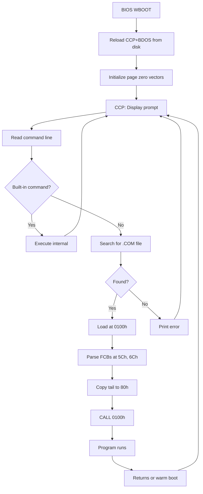

# CCP - Console Command Processor

## Overview

The CCP is the command-line interface. It displays the prompt, parses commands, and either executes built-in commands or loads .COM files from disk.

## Boot Sequence



## Built-in Commands

| Command | Description |
|---------|-------------|
| `dir [filespec]` | List directory |
| `era filespec` | Erase files (wildcards allowed) |
| `ren new=old` | Rename file |
| `save n file` | Save n pages from TPA to file |
| `type file` | Display text file |
| `user n` | Switch user area (0-15) |
| `d:` | Change current drive |

## Command Line Parsing

Initial parsing (in `PARSE`):
1. Convert to uppercase
2. Parse first word (command) into DFCB (005Ch)
3. Parse second word (argument) into DFCB2 (006Ch)

**Important:** For built-in commands, DFCB contains the command name (e.g., "TYPE"), not the filename. Built-in commands must re-parse the command line from DBUFF to get their argument.

DIR, TYPE, ERA all use this pattern:
```asm
        LXI     H, DBUFF+1      ; Start of command line
        ; Skip command name
SKIP1:  MOV     A, M
        CPI     ' '
        JZ      SKIP2
        INX     H
        JMP     SKIP1
        ; Skip spaces
SKIP2:  MOV     A, M
        CPI     ' '
        JNZ     PARSE
        INX     H
        JMP     SKIP2
        ; Parse argument into DFCB
PARSE:  LXI     D, DFCB
        CALL    PARFCB
```

For transient commands (.COM files), DFCB correctly contains the program name.

## Prompt Format

```
A>_
```

Where A is current drive letter (A-P) and > is the prompt character.

## Transient Command Loading

1. Add `.COM` extension to FCB (DFCB+9 = "COM")
2. Call BDOS Open (FUNC15) to find file
3. Load file at 0100h in 128-byte records (FUNC20)
4. Check for overflow into CCP address space
5. Set up program environment:
   - Copy command tail (arguments only) to 0080h with length byte
   - Clear and re-parse FCBs from command tail
   - Set DMA to 0080h
6. `CALL 0100h`

**Critical:** Before running a transient program, the CCP must:
- Clear DFCB (005Ch) completely - not just extent/CR fields
- Set DBUFF (0080h) to contain only the arguments, not the command name
- DBUFF+0 = length of arguments
- DBUFF+1+ = argument string (spaces and all)

If DBUFF still contains "MBASIC" when MBASIC.COM runs, MBASIC will try to load "MBASIC.BAS" and fail with "File not found".

## Internal Helper Functions

### OUTCHR
Outputs character in C register. Preserves HL and BC for caller convenience (BDOS corrupts HL):
```asm
OUTCHR: PUSH    H               ; Preserve HL
        PUSH    B               ; Preserve BC
        MOV     E, C            ; E = character
        MVI     C, B_CONOUT     ; Function 2
        CALL    ENTRY
        POP     B
        POP     H
        RET
```

### BDOSCL
Generic BDOS call wrapper. Preserves HL and BC:
```asm
BDOSCL: PUSH    H
        PUSH    B
        CALL    ENTRY
        POP     B
        POP     H
        RET
```

### TOUPPER
Converts lowercase (a-z) to uppercase (A-Z). Returns unchanged if not lowercase.

## CCP Startup Sequence

1. Entry from warm boot with C = current drive
2. Save drive number to CURDSK
3. Call BDOS Reset (FUNC13) to initialize BDOS variables
4. Enter main command loop

## Related
- [bdos.md](bdos.md) - System calls used by CCP
- [memory-map.md](memory-map.md) - Page zero layout
