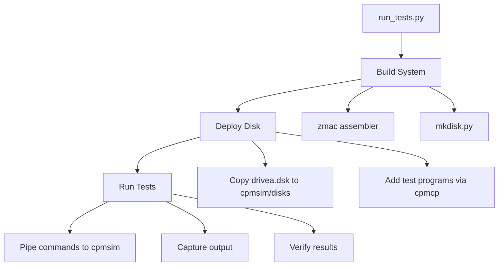

# Testing Infrastructure

Automated test harness for verifying CP/M functionality.

## Test Harness

`tests/run_tests.py` - Cross-platform Python test runner

### Usage

```bash
# Run all tests (builds first)
python3 tests/run_tests.py

# Run with verbose output
python3 tests/run_tests.py -v

# Skip build step
python3 tests/run_tests.py --no-build

# Run specific test
python3 tests/run_tests.py --test type
```

### Architecture



### Test Flow

1. **Build**: Assembles all components and creates disk image
2. **Deploy**: Copies disk to cpmsim's disks directory
3. **Add test files**: Uses cpmcp to add test data files
4. **Execute**: Pipes commands to cpmsim via stdin
5. **Verify**: Checks output for expected patterns

### Current Tests

| Test | Description | What it verifies |
|------|-------------|------------------|
| boot | System boots | Boot message, prompt appears |
| dir | DIR command | File listing works |
| type | TYPE command | File contents displayed |
| era | ERA command | File deletion works |
| ren | REN command | File renaming works |
| hello | Program execution | hello.com runs correctly |
| save | SAVE command | Save memory to file, verify it runs |
| fileio | File I/O operations | Create, write, close, open, read, verify data |
| bigfile | Multi-extent file | Write 200 records (25K spanning 2 extents), read back, verify |

### Test Programs

`tests/programs/fileio.asm` - Single-extent file I/O test:
1. Creates a file using MAKE
2. Writes a 128-byte pattern using WRITE
3. Closes and reopens the file
4. Reads the data back
5. Verifies the data matches

`tests/programs/bigfile.asm` - Multi-extent file test:
1. Creates BIGTEST.TMP
2. Writes 200 records (25K, spans 2 extents at 128 records each)
3. Each record filled with its record number (0-199)
4. Closes and reopens file
5. Reads all 200 records sequentially
6. Verifies each record's data matches expected pattern
7. Tests extent transition at record 128 (crossing from extent 0 to extent 1)

### Cross-Platform Support

The harness works on Linux and Windows:

- **Linux/Mac**: Uses `printf | timeout cpmsim` for command input
- **Windows**: Uses `subprocess.Popen` with stdin pipe

cpmsim locations searched:
- Linux: `~/workspace/z80pack/cpmsim`, `~/z80pack/cpmsim`, `~/.z80pack/cpmsim`
- Windows: `~/z80pack/cpmsim`, `C:/z80pack/cpmsim`

### Adding New Tests

```python
def test_example(tester: CpmTester):
    """Test description"""
    # Optional: add files to disk
    tester.create_text_file("TEST.TXT", "content")

    # Run commands
    success, output = tester.run_cpmsim(["COMMAND ARG"], timeout=5)
    if not success:
        return False, output, output

    # Verify output
    if "expected text" in output:
        return True, "Test passed", output

    return False, "Expected text not found", output

# Add to all_tests list in main()
all_tests = [
    # ... existing tests ...
    ("example", lambda: test_example(tester)),
]
```

### Dependencies

- Python 3.8+
- cpmtools (`cpmcp`, `cpmls`) for disk manipulation
- z80pack cpmsim emulator
