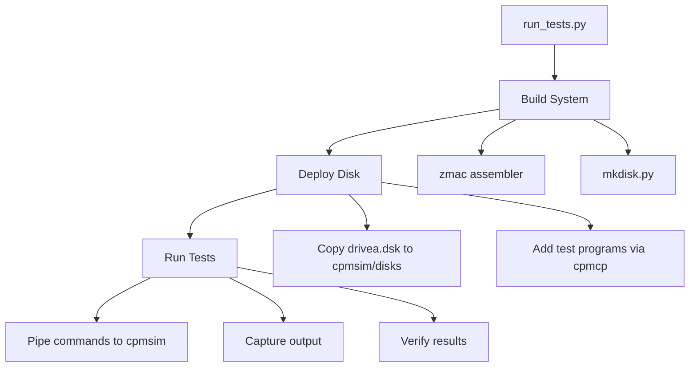

# Testing Infrastructure

Automated test harness for verifying CP/M functionality.

## Test Harness

`tests/run_tests.py` - Cross-platform Python test runner

### Usage

```bash
# Run all tests (builds first)
python3 tests/run_tests.py

# Run with verbose output
python3 tests/run_tests.py -v

# Skip build step
python3 tests/run_tests.py --no-build

# Run specific test
python3 tests/run_tests.py --test type
```

### Architecture



### Test Flow

1. **Build**: Assembles all components and creates disk image
2. **Deploy**: Copies disk to cpmsim's disks directory
3. **Add test files**: Uses cpmcp to add test data files
4. **Execute**: Pipes commands to cpmsim via stdin
5. **Verify**: Checks output for expected patterns

### Current Tests (23 total)

| Test | Program | Description | BDOS Functions Tested |
|------|---------|-------------|----------------------|
| boot | - | System boots | - |
| dir | - | DIR command | F17, F18 |
| type | - | TYPE command | F15, F20 |
| era | - | ERA command | F19 |
| ren | - | REN command | F23 |
| hello | - | Program execution | F9 |
| save | - | SAVE command | F22, F21 |
| fileio | fileio.asm | Sequential file I/O | F22, F21, F16, F15, F20 |
| bigfile | bigfile.asm | Multi-extent file | F22, F21, F16, F15, F20 (extent spanning) |
| version | tversion.asm | Version check (4 tests) | F12 |
| disk_mgmt | tdisk.asm | Disk management (17 tests) | F13, F14, F24, F25, F27, F29, F31, F37 |
| search | tsearch.asm | Directory search (9 tests) | F17, F18 |
| user | tuser.asm | User number | F32 |
| random | trandom.asm | Random access | F33, F34, F35, F36, F40 |
| attrib | tattrib.asm | File attributes | F30 |
| iobyte | tiobyte.asm | IOBYTE and write protect (8 tests) | F7, F8, F28 |
| conch | tconch.asm | Console character I/O | F1, F2 |
| constr | tconstr.asm | Console string I/O | F9, F10, F11 |
| rawio | trawio.asm | Direct console I/O | F6 |
| auxlst | tauxlst.asm | Auxiliary/list devices | F3, F4, F5 |
| open | topen.asm | File open/close (8 tests) | F15, F16 |
| delete | tdelete.asm | File delete (8 tests) | F19 |
| seqio | tseqio.asm | Sequential I/O (8 tests) | F20, F21 |

**Status**: 23/23 tests pass

### Test Programs (tests/programs/*.asm)

**Important**: Filenames must follow CP/M 8.3 format (8 chars max + 3 char extension). Use prefixes like `t` instead of `test_`.

| File | Description |
|------|-------------|
| fileio.asm | Sequential file I/O - create, write, close, reopen, read, verify |
| bigfile.asm | Multi-extent file - 200 records spanning 2 extents |
| tversion.asm | Version check - verifies F12 returns 0022H (4 tests) |
| tdisk.asm | Disk management - F13,14,24,25,27,29,31,37 + DPB fields (17 tests) |
| tsearch.asm | Directory search with wildcards + DMA verification (9 tests) |
| tuser.asm | User number get/set |
| trandom.asm | Random access read/write/size/setrandom |
| tattrib.asm | File attributes (read-only, system, archive) |
| tiobyte.asm | IOBYTE and write protect operations (8 tests) |
| tconch.asm | Console character I/O - F1 input with echo, F2 output |
| tconstr.asm | Console string I/O - F9 print, F10 buffered input, F11 status |
| trawio.asm | Direct console I/O - F6 all 4 modes (output, status, blocking/non-blocking input) |
| tauxlst.asm | Auxiliary/list devices - F3 reader, F4 punch, F5 list output |
| topen.asm | File open/close - FCB field verification (8 tests) |
| tdelete.asm | File delete - single, wildcard, verification (8 tests) |
| tseqio.asm | Sequential I/O - CR increment, EOF, extent transitions (8 tests) |

All test programs follow the same pattern:
1. Print test header
2. Run numbered test cases (T1, T2, etc.)
3. Print OK/NG for each test
4. Print summary: "X of Y tests" then PASS/FAIL

### Cross-Platform Support

The harness works on Linux and Windows:

- **Linux/Mac**: Uses `printf | timeout cpmsim` for command input
- **Windows**: Uses `subprocess.Popen` with stdin pipe

cpmsim locations searched:
- Linux: `~/workspace/z80pack/cpmsim`, `~/z80pack/cpmsim`, `~/.z80pack/cpmsim`
- Windows: `~/z80pack/cpmsim`, `C:/z80pack/cpmsim`

### Adding New Tests

```python
def test_example(tester: CpmTester):
    """Test description"""
    # Optional: add files to disk
    tester.create_text_file("TEST.TXT", "content")

    # Run commands
    success, output = tester.run_cpmsim(["COMMAND ARG"], timeout=5)
    if not success:
        return False, output, output

    # Verify output
    if "expected text" in output:
        return True, "Test passed", output

    return False, "Expected text not found", output

# Add to all_tests list in main()
all_tests = [
    # ... existing tests ...
    ("example", lambda: test_example(tester)),
]
```

### Input Injection for Console Tests

Tests for console input functions (F1, F6, F10) require injecting characters that the program will read. The `program_input` parameter appends raw data after commands:

```python
def test_console_input(tester: CpmTester):
    """Test that reads input via F1"""
    # TCONCH command runs the program
    # "AB" is what F1 will read (first call gets 'A', second gets 'B')
    success, output = tester.run_cpmsim(["TCONCH"], timeout=10,
                                         program_input="AB")
    if "PASS" in output:
        return True, "Console input test passed", output
    return False, "Console input test failed", output
```

**How it works**: All stdin flows through BIOS CONIN. CCP reads the command, then when the program calls F1/F6/F10, it reads the remaining stdin bytes.

### Dependencies

- Python 3.8+
- cpmtools (`cpmcp`, `cpmls`) for disk manipulation
- z80pack cpmsim emulator

## Compatibility Testing

Third-party CP/M software tested on Lolos:

| Software | Version | Status | Notes |
|----------|---------|--------|-------|
| BBC BASIC | 5.x | ✅ Works | FOR/NEXT, PRINT, program entry, file I/O |
| MBASIC | 5.29 | ✅ Works | Interactive mode, backspace works |
| Adventure | - | ✅ Works | Colossal Cave, reads data file |

Note: CP/M software typically requires UPPERCASE input.
